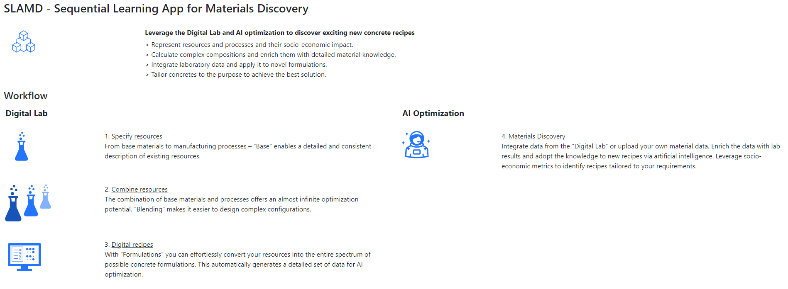

# SLAMD

The objective of **SLAMD** is to accelerate materials research in the wet lab through AI. Currently, the focus is on sustainable concrete and binder formulations, but it can be extended to other material classes in the future.

(Web-hosted version available under: https://slamd-demo.herokuapp.com)

1. [Summary](#summary)
2. [Project Setup](#project_setup)
   1. [Installation](#project_installation)
   2. [Starting the App](#start_app)
   3. [Unit Tests](#unit_tests)
   4. [Acceptance Tests](#acceptance_tests)
3. [Resources](#documentation)
4. [Homepage and Contact](#contact)

## Preview: 

## 1. Summary

##### Leverage the Digital Lab and AI optimization to discover exciting new materials

- Represent **resources and processes** and their environmental and economic **impact**.
- Calculate complex compositions and enrich them with **detailed material knowledge**.
- **Integrate laboratory data** and apply it to novel formulations.
- **Tailor materials** to the purpose to achieve the best solution.

### Workflow

#### Digital Lab

**1. Specify resources:**
   From base materials to manufacturing processes – "Base" enables a detailed and consistent description of existing resources
   
**2. Combine resources:**
   The combination of base materials and processes offers an almost infinite optimization potential. "Blend" makes it easier to design complex configurations.
   
**3. Digital Formulations:**
   With "Formulations" you can effortlessly convert your resources into the entire spectrum of possible concrete formulations. This automatically generates a detailed set of data for AI optimization.

#### AI-Optimization

**4. Materials Discovery:**
   Integrate data from the "Digital Lab" or upload your own material data. Enrich the data with lab results and adopt the knowledge to new recipes via artificial intelligence. Leverage socio-economic metrics to identify recipes tailored to your requirements.

## 2. Project Setup 

The following sections describe how to install and run the app. Further, it is explained how tests can be executed. While
the former are required for using the app locally, the latter is optional and might be useful in case one wants to dig deeper
into the code or extend the app locally.

### 2.1 Installation (Required) 

##### Prerequisites
In order to run the app you need Python >= 3.8. The most up-to-date version can be downloaded here:
[Python Download](https://www.python.org/)

For running sequential learning with the lolopy random forest implementation you also need to have Java >= 8 installed.
You find the current version for installation here: [Java Download](https://www.oracle.com/java/technologies/downloads/)

Having Python and Java installed, you can now either clone the repository or download the zip on the green "Code" button of this projects Github main page.

Having cloned / unzipped the project you should first navigate to the root directory (WEBSLAMD) of the project 
(via command line or by opening a command line directly in the root directory). Otherwise you need
to adjust the paths below accordingly.

##### Installation of dependencies with pip
- Create a new venv running `python3 -m venv <name_of_virtualenv>`
- Enter venv by executing `.\<name_of_virtualenv>\Scripts\activate` (Windows) or `source /<name_of_virtualenv>/bin/activate` (Unix and Mac)
- Install all dependencies via `pip3 install -r requirements.txt`

##### Installation of dependencies with conda
On Linux:
- Download and install [Miniconda](https://docs.conda.io/en/latest/miniconda.html).
- Open a terminal in your project folder and run `conda env create -f environment.yml`
- You have now installed a new conda environment named WEBSLAMD. You need to activate the environment before you can use it using `conda activate WEBSLAMD`

On Windows:
- Install [anaconda](https://www.anaconda.com/). Anaconda provides its own Python version; you do not need to manually install Python. (Advanced users may also use miniconda on Windows, instead.)
- Open "Anaconda Prompt" from your start menu and navigate to your project folder.
- Run `conda env create -f environment.yaml`
- You have now installed a new conda environment named WEBSLAMD. You need to activate the environment before you can use it using `conda activate WEBSLAMD`, or by opening the anaconda navigator and going to "Environments", then selecting the WEBSLAMD environment and click "Open Terminal". You will need to run the project from here.

### 2.2 Starting the App (Required) 

In order to start the app, you must specify some environment variables. This can e.g. be done via command line.
For convenience, we added two scripts (`run.bat` for Windows and `run.sh` for Unix and Mac) which automate these steps.
Both require setting a key which for the sake of using the app locally can be taken to be any string. Note that in general,
this should be generated in a secure manner e.g. using Python's `os.urandom()`.
Furthermore, make sure that on Unix-based systems you set execution permissions as follows:

- `chmod +x run.sh`

Now execute the corresponding script from the root directory of this project as follows.

- `run.bat <KEY> <OpenAI_API_Key>` (Windows)
- `./run.sh <KEY> <OpenAI_API_Key>` (Unix / Mac)

In a local deployment `<KEY>` can be replaced by `ABC`, i.e. `run.bat ABC` or `./run.sh ABC`. The <OpenAI_API_Key>is a required, enabling authentication and access to OpenAI's services to incorporate LLM functionalities locally. If no API key is available simple type ABC, i.e. `run.bat ABC ABC` or `./run.sh ABC ABC`
The console should now show that the app is running. You can now open http://127.0.0.1:5001 in your browser to
access the running application.

### 2.3 Running Unit Tests (Optional) 

Go to the root directory and run `pytest` to run all tests. If you want to generate a report showing test coverage, run
`pytest --cov=slamd tests/`

### 2.4 Running Acceptance Tests (Optional) 

We have several end-to-end tests in Cypress. More information about the framework here: [Cypress Website](https://www.cypress.io/)

##### Prerequisite 
In order to run the cypress tests you need [Node.js](https://nodejs.org/). The most up-to-date version can be downloaded here:
[https://nodejs.org/en/download/](https://nodejs.org/en/download/). Note that the prompt might ask you if you want to install additional
options. This step can be skipped as it is not required for our purposes.

After installing node, go to the root directory and run `npm install` to install necessary node dependencies.

##### Execution
Once all dependencies are installed, start the flask server (see _2. Starting the App (Required)_).
You may now navigate to the root directory and run `npm run test` to run all the tests in the command line.

If you prefer to watch the test running in a GUI, go to the root directory and run `npm run cypress:open`.
A window will open. Select "E2E Testing" and then select any browser on the list.
You may then run each specs file separately and see the tests in action.

## 3. Resources (Optional) 

Find the documentation here: https://github.com/BAMresearch/SLAMD_Doku. It explains details about the code as well as the usage of the app.

#### Articles

1. **Presenting SLAMD - A Sequential Learning-based Software for the Inverse Design of Sustainable Cementitious Materials .** Christoph Völker, Benjami Moreno Torres, Ghezal Ahmad Zia, Rafia Firdous, Tehseen Rug, Felix Böhmer, Dietmar Stephan, and Sabine Kruschwitz. NanoWorld  Journal, 2023. This paper introduces SLAMD, a bespoke software that leverages inverse design to identify ideal sustainable building materials. This paper does not aim to benchmark ID as a methodology, but rather to introduce SLAMD as an innovative tool that brings the ID approach within the grasp of the wider building chemistry community. It elucidates the design concepts behind the software and provides a walkthrough of its workflow, aiming to empower professionals in the field to harness this potent tool in their work. [Available in NanoWorld Journal](https://jnanoworld.com/2023/09/27/presenting-slamd-a-sequential-learning-based-software-for-the-inverse-design-of-sustainable-cementitious-materials/).
2. **Beyond Theory: Pioneering AI-Driven Materials Design in the Sustainable Building Material Lab.** Christoph Völker, Elisabeth John, Rafia Firdous, Tamino Hirsch, Daria Kaczmarek,Kevin Ziesak, Anja Buchwald, Dietmar Stephan, Sabine Kruschwitz (Preprint). Our study explores the use of SLAMD to enhance the sustainability and performance of building materials. We compare SLAMD's data-driven approach with traditional Design of Experiments (DOE) in creating high-performance, alkali-activated materials, demonstrating that AI significantly outperforms traditional methods in speed and quality of development. This research highlights AI’s potential to revolutionize sustainable materials science, providing vital insights into its application in real-world settings. [Available on ResearchGate.net](https://www.researchgate.net/publication/378544585_Beyond_Theory_Pioneering_AI-Driven_Materials_Design_in_the_Sustainable_Building_Material_Lab).
3. **Data driven design of Alkali-activated concrete using Sequential Learning.** Christoph Völker, Benjami Moreno Torres, Tehseen Rug, Rafia Firdous, Ghezal Ahmad Jan Zia, Stefan Lüders, Horacio Lisdero Scaffino, Michael Höpler, Felix Böhmer, Matthias Pfaff, Dietmar Stephan, and Sabine Kruschwitz. Journal of Cleaner Production, 2023. 
The authors present a large-scale case study that demonstrates the potential of sequential learning for concrete mix designs. This work challenges common practices in data-driven materials development for building materials:
   - Our results show training data required for data-driven design may be much less than commonly suggested.
   - Further, it is more important to establish a practical design framework than to develop more accurate models.
The clear guidance provided in this paper allows immediate adoption into practical applications and suggests that this can be translated into significant advances in sustainable building materials development. [Available in Journal of Cleaner Production](https://doi.org/10.1016/j.jclepro.2023.138221).
4. **Accelerating the search for alkali-activated cements with sequential learning.** Christoph Völker, Sabine Kruschwitz, Benjami Moreno Torres, Rafia Firdous, Ghezal Ahmad Jan Zia, and Dietmar Stephan. Proceedings of FIB Conference 2022, Oslo, Norway, 2022. This paper investigates the use of sequential learning methods for accelerating the discovery of alkali-activated cements. The study demonstrates the potential of sequential learning in reducing the number of experiments required to identify optimal cements. [Available on ResearchGate.net](https://doi.org/10.13140/RG.2.2.33502.92480/1).
5. **Sequential learning to accelerate discovery of alkali-activated binders.** Christoph Völker, Rafia Firdous, Dietmar Stephan, et al. Journal of Materials Science, vol. 56, no. 21, 2021, pp. 15859-15881. This paper presents a study on the use of sequential learning to accelerate the discovery of alkali-activated binders. The study demonstrates the potential of sequential learning in reducing the number of experiments required to identify optimal binders, leading to faster discovery and development of sustainable building materials. [Available in Journal of Materials Science](https://doi.org/10.1007/s10853-021-06324-z).
   

#### Data
- **SLAMD session data and an alkali-activated concrete data set** which contains ground truth data and for the AI optimization of SLAMD. This data has been created for teaching purposes: [SLAMD example data](https://github.com/BAMcvoelker/Praktikum_MD)
- ***A comprehensive alkali-activated concrete data set*** for Sustainable Building Materials: [DOI: 10.5281/zenodo.7693719](https://doi.org/10.5281/zenodo.7693719).
- **9 ML-ready data extracted from the comprehensive data set** and used in references 3) and 4): [GitHub Repository](https://github.com/BAMcvoelker/Green-building-materials-a-new-frontier-in-data-driven-sustainable-concrete-design/tree/main/Data_and_Code/Data_sets).
- **ML-ready data** used in reference 5): [GitHub Repository](https://github.com/BAMcvoelker/Sequential-Learning-for-AAB-discovery/blob/main/AAC_data_Publish.xlsx).

#### Videos

- **Introduction to SLAMD with Video Tutorial**: Dive into SLAMD through our engaging video tutorial. This introduction includes a hands-on session featuring a practical case study, offering insights into the application of SLAMD in real-world scenarios. Watch it on YouTube: [SLAMD Introductory Tutorial](https://www.youtube.com/watch?v=0fAW2tg2KZM&t=969s).

- **Seminar on Data-Driven Design in Cementitious Materials**: Explore the innovative world of data-driven design for cementitious materials in our detailed seminar. This session covers the outcomes of extensive benchmarking exercises, utilizing real-world laboratory data from tens of thousands of experiments. The seminar is conducted in German and available on YouTube: [Data-Driven Design Seminar](https://www.youtube.com/watch?v=VXPrYZ7NJlM&t=422s).

## 4. Homepage and Contact 

**Homepage:** [https://www.bam.de/Content/EN/Projects/SLAMD/slamd.html](https://www.bam.de/Content/EN/Projects/SLAMD/slamd.html)  
**Contact:** [Sabine Kruschwitz](mailto:Sabine.Kruschwitz@bam.de)

Feel free to reach out to us if you have any questions or would like to learn more about SLAMD!

